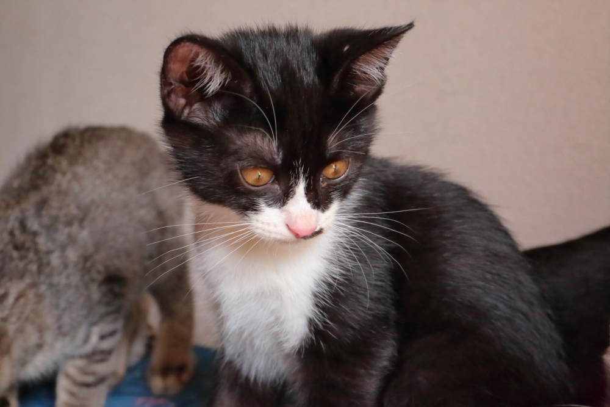

# cat
<html lang="ja">
 <head>
  <meta charset="utf-8" />
 
   
</head>
<body>
<h1><marquee behavior="alternate">!!! 2018年5月19日(土)猫の子供たちが生まれました !!!</marquee></h1>

<marquee direction="right" scrollamount="20" width="30%">(^_^)/~Hello</marquee>

<h3>↓ 画像はクリックで拡大します。閲覧後はブラウザの戻るボタンでお戻りください。</h3>

<h4>
～～里親募集中～～
</h4> 

